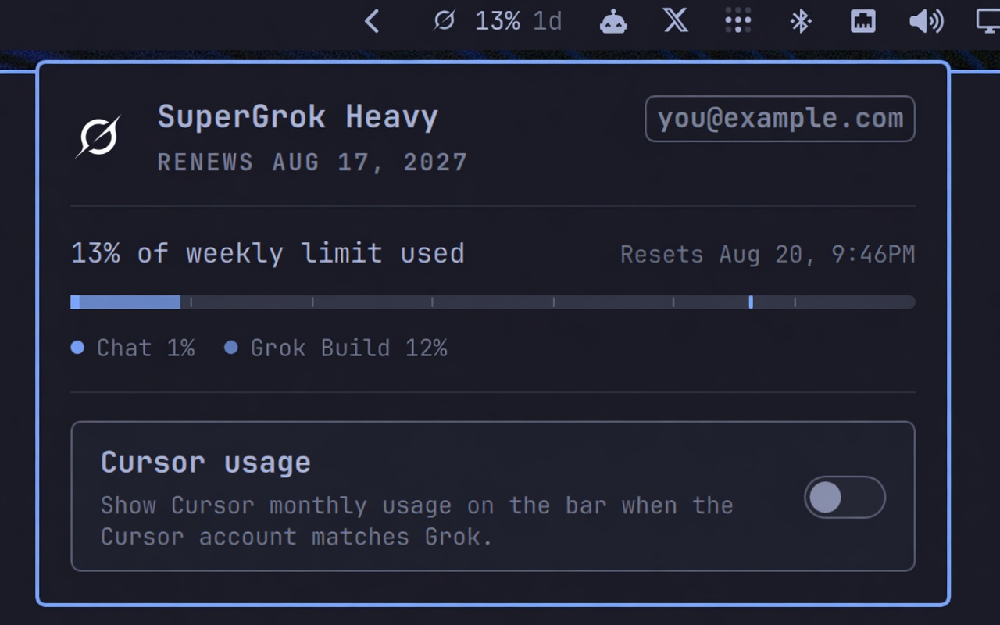

# Claude & Grok

Omarchy bar widget for Claude Code and SuperGrok usage, plus optional Cursor and Grok Bot.



Plugin id: `pixbroker.grokbar-omarchy`.

- **Grok** — icon, weekly pool percent, and reset (`5d` / `12h`)
- **Grok Bot** — off by default; enable from panel settings to show weekly % and reset
- **Cursor** — off by default; enable from panel settings to show Cursor Models %, Other Models %, and reset
- **Claude** — session %, weekly %, extra windows, and reset when a Claude Code login exists

Left click opens the usage panel. Right click refreshes. The widget hides when there is nothing to show.

Cursor and Grok Bot usage are shown only when the local Cursor session belongs to the same account as Grok. Other Cursor logins stay hidden. Grok Bot’s weekly pool is metered on that Cursor account, separate from SuperGrok’s weekly pool. Claude usage reads the local Claude Code login (`~/.claude`) and Anthropic’s usage endpoint. The panel shows the live account name with the subscription email under it, plus SuperGrok rebill/expiry, from the Grok and Cursor APIs.

## Install

Plugin id: `pixbroker.grokbar-omarchy`. Plugins stay disabled until you enable them.

```sh
omarchy plugin add https://github.com/pixbroker/grokbar-omarchy.git --enable
```

Or add, then enable on the right of the bar:

```sh
omarchy plugin add https://github.com/pixbroker/grokbar-omarchy.git
omarchy plugin enable pixbroker.grokbar-omarchy --section right
```

Requires **Python 3** on `PATH` (stdlib only; no extra packages). Sign in with the official Grok Build CLI (`grok login`) so SuperGrok usage can load, and `claude auth login` for Claude Code. Cursor and Grok Bot usage additionally need a Cursor session for the same account as Grok.

## Usage

- Bar: left click = panel, right click = refresh
- Panel: gear (or `g`) opens settings, reload button (or `r` / Enter) refreshes, Tab neighboring panel, Esc close
- Click the SuperGrok, Claude, Grok Bot, or Cursor title to show account name, email, and renewal
- The reload icon spins while usage refreshes
- Gear flips to settings for **Claude usage** (on by default), plus **Cursor usage** and **Grok Bot usage** (off by default). Back or Esc returns to usage.

## Configure

```sh
omarchy bar set pixbroker.grokbar-omarchy showCursorUsage true --json
omarchy bar set pixbroker.grokbar-omarchy showGrokBotUsage true --json
omarchy bar set pixbroker.grokbar-omarchy showClaudeUsage true --json
omarchy bar set pixbroker.grokbar-omarchy refreshIntervalSec 120 --json
```

| Key | Default | What it does |
|---|---|---|
| `showCursorUsage` | `false` | Show Cursor monthly pools on the bar |
| `showGrokBotUsage` | `false` | Show Grok Bot weekly pool on the bar |
| `showClaudeUsage` | `true` | Show Claude Code session and weekly pools on the bar |
| `refreshIntervalSec` | `300` | How often the scanners re-run |
| `authPath` | `""` | Optional Grok `auth.json` override |
| `cursorAuthPath` | `""` | Optional Cursor CLI `auth.json` override |
| `stateDbPath` | `""` | Optional Cursor `state.vscdb` override |
| `claudeConfigDir` | `""` | Optional Claude Code config dir override |

## Remove

```sh
omarchy plugin disable pixbroker.grokbar-omarchy
omarchy plugin remove pixbroker.grokbar-omarchy --yes
```

Removal deletes the cloned plugin folder. It does not change Grok or Cursor login files. If you also installed an older standalone Cursor usage plugin, disable that too so you do not get two Cursor clusters.

## Privacy

This plugin reads local Grok, Cursor, and Claude Code session files on your machine to call the official usage and subscription APIs (including Grok Bot weekly usage on the Cursor dashboard and Claude Code limits on Anthropic’s OAuth usage endpoint). It never logs tokens. Account name, email, and SuperGrok rebill/expiry are loaded from those APIs at runtime and shown in the panel. Expired Grok (and Cursor CLI) tokens may be refreshed and written back to those same local files.

## License

MIT. See [LICENSE](LICENSE).
